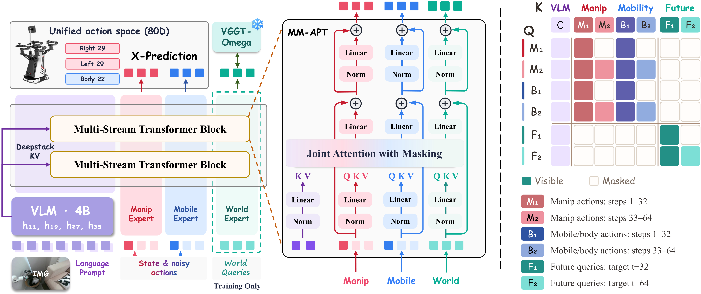

<h1 align="center">MM-ABC: Towards Generalist Mobile Manipulation via Seeing, Coordinating and Imagining</h1>

<p align="center">
  <a href="https://mm-abc.github.io/"></a>
  <a href="https://arxiv.org/abs/2609.35652"></a>
  <a href="https://github.com/MM-ABC/MM-ABC"></a>
  <a href="https://huggingface.co/datasets/Kivy/MM-30"></a>
  <a href="https://huggingface.co/Qwen/Qwen3-VL-4B-Instruct"></a>
  <a href="https://huggingface.co/facebook/VGGT-Omega"></a>
</p>

<p align="center">
  
</p>

MM-ABC reads multi-view images, an instruction, and a robot state, then generates a short action chunk. The default objective predicts the **clean action** (`pred_type: x`) and scores it in **velocity space** (`loss_type: v`).

| | |
|---|---|
| **Seeing** | Qwen3-VL-4B. Layers 11, 19, 27, and 35 condition the action expert. |
| **Coordinating** | Manipulation `[0, 56)` and body motion `[56, 75)` share masked attention. |
| **Imagining** | A future head matches frozen [VGGT-Omega](https://huggingface.co/facebook/VGGT-Omega) features. Dropped at inference. |

Real-world demonstrations are released as **[MM-30](https://huggingface.co/datasets/Kivy/MM-30)** on Hugging Face.

## Action space

The released interface is the **75-dimensional MiVerse** vector. Adapting the model to a different benchmark requires editing this action configuration. Poses enter as `[x, y, z, qw, qx, qy, qz]` and are stored as position plus a 6D rotation. `pack` / `unpack` convert between raw keys and this vector. Values passed into the network are normalised.

| Slice | Signal | Raw key | Slice | Signal | Raw key |
|---|---|---|---|---|---|
| 0:7 | left arm joints | `left_arm_joint_state` | 56:58 | waist | `waist_joint_state` |
| 7:14 | right arm joints | `right_arm_joint_state` | 58:60 | leg | `leg_joint_state` |
| 14:26 | left hand | `left_ee_joint_state` | 60:69 | head pose | `head_base_pose` |
| 26:38 | right hand | `right_ee_joint_state` | 69:72 | root linear velocity | `root_linear_velocity` |
| 38:47 | left end-effector pose | `left_base_ee_pose` | 72:75 | root angular velocity | `root_angular_velocity` |
| 47:56 | right end-effector pose | `right_base_ee_pose` | | | |

## Quick start

```bash
pip install -r requirements.txt
# optional, faster attention
pip install flash-attn --no-build-isolation

bash scripts/download_pretrained.sh
python examples/infer.py
python examples/train.py --steps 2
```

[VGGT-Omega](https://huggingface.co/facebook/VGGT-Omega) is gated. Accept the license on that page, then `huggingface-cli login`, before the download script. The script places files here:

```text
pretrained_ckpt/Qwen3-VL-4B-Instruct/          # https://huggingface.co/Qwen/Qwen3-VL-4B-Instruct
pretrained_ckpt/vggt-omega/                    # https://github.com/facebookresearch/vggt-omega
pretrained_ckpt/VGGT-Omega/vggt_omega_1b_256_text.pt
```

Equivalent commands:

```bash
huggingface-cli download Qwen/Qwen3-VL-4B-Instruct \
  --local-dir pretrained_ckpt/Qwen3-VL-4B-Instruct

git clone --depth 1 https://github.com/facebookresearch/vggt-omega.git pretrained_ckpt/vggt-omega

huggingface-cli download facebook/VGGT-Omega vggt_omega_1b_256_text.pt \
  --local-dir pretrained_ckpt/VGGT-Omega
```

## Tensors

`examples/infer.py` and `examples/train.py` build these shapes and run the model. Swap the random tensors for your own normalised data.

| | Inference | Training |
|---|---|---|
| images | `uint8 (B, 3, 224, 224, 3)` | `uint8 (B, 3, 2, 224, 224, 3)` |
| state | `float32 (B, 75)` | `float32 (B, 75)` |
| action | `float32 (B, 32, 75)` | target `float32 (B, 32, 75)` |

Training image index `0` is the current frame. Index `1` is the future frame used by the auxiliary loss. Inference returns a 32-step chunk; execute the first 16 steps, then replan. The future head is not called at inference.

```python
from mmabc import MMABCPolicy, load_model_config, pack, unpack
from mmabc.batch import make_batch

policy = MMABCPolicy(load_model_config("configs/model/mmabc_4b.yaml")).cuda().eval()
batch = make_batch(policy, images, state, "pick up the cup")
action = policy.predict_action(batch)          # (B, 32, 75)
arm = unpack(action[0, :16].float().cpu().numpy())["left_arm_joint_state"]
```

`python examples/train.py` runs AdamW on the same batch contract (`1e-5` on the backbone, `1e-4` on the expert) under bfloat16 autocast. `--draws` sets how many noise samples share one visual forward pass.

## Citation

```bibtex
@article{liang2026mm,
  title={MM-ABC: Towards Generalist Mobile Manipulation via Seeing, Coordinating and Imagining},
  author={Liang, Qiwei and Chen, Guangyu and Zhu, Shaolong and Xiao, Zikuan and Lu, Jinxuan and Xie, Yifan and Xu, Renjing and Ding, Wenbo and Chen, Tianxing},
  journal={arXiv preprint arXiv:2609.35652},
  year={2026}
}
```
